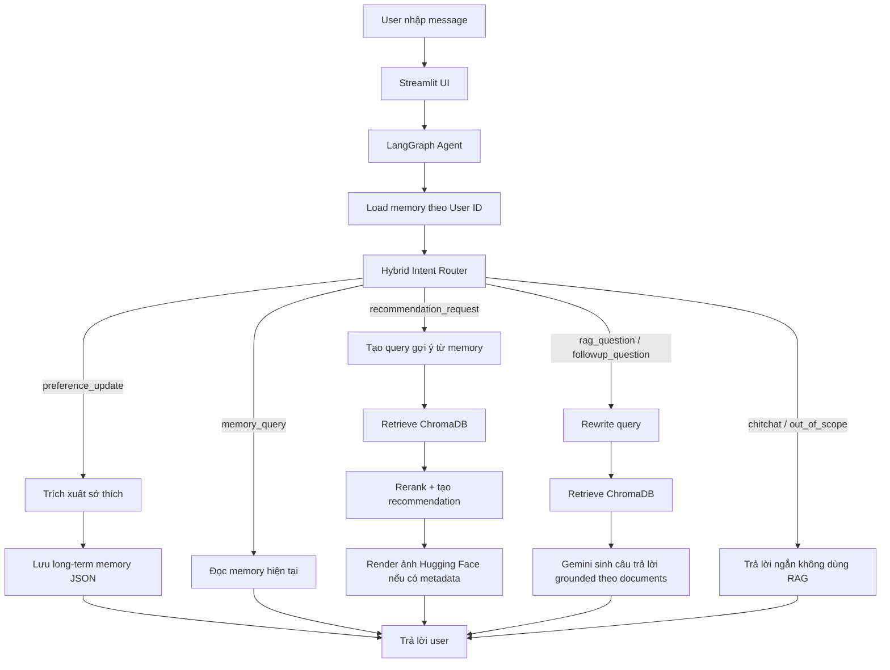

# VietCulture Assistant

VietCulture Assistant là chatbot hỏi đáp và gợi ý văn hóa Việt Nam theo hướng cá nhân hóa. Project kết hợp RAG trên ChromaDB, intent routing, long-term memory theo người dùng, recommendation dựa trên sở thích, và giao diện Streamlit có ảnh từ Hugging Face dataset.

Dataset tham chiếu: [Dangindev/viet-cultural-vqa](https://huggingface.co/datasets/Dangindev/viet-cultural-vqa)

## Tính Năng Chính

- Hỏi đáp văn hóa Việt Nam bằng RAG.
- Lưu sở thích người dùng theo `User ID`.
- Gợi ý chủ đề văn hóa dựa trên memory và tài liệu retrieve được.
- Hybrid intent router: rule-based router chạy trước, LLM chỉ fallback khi bật cấu hình.
- Streamlit UI gồm màn chào, chat screen, avatar assistant, topic cards và recommendation cards có ảnh từ Hugging Face.
- Hỗ trợ build Chroma index riêng từ Vietnamese Cultural VQA dataset.

## Pipeline



## Cấu Trúc Project

```text
streamlit_app.py
  Giao diện web Streamlit: welcome screen, chat, memory sidebar, ảnh Hugging Face.

assets/
  Ảnh avatar assistant dùng trong UI.

.agents/readable-module-code/
  Quy tắc viết code/comment cho project: chú thích tiếng Việt, rõ mục đích file,
  flow hàm, biến đầu vào, ví dụ output và cách tự viết lại hàm.

src/agent/
  config.py: đọc .env và cấu hình runtime.
  graph.py: LangGraph pipeline cho routing, memory, RAG và recommendation.

src/routing/
  intent_router.py: rule-based intent router.
  llm_intent_router.py: LLM fallback router.
  routing.py: compatibility layer cho API routing cũ.
  text_utils.py: helper chuẩn hóa text tiếng Việt.

src/memory/
  store.py: lưu/đọc memory JSON theo user_id.

src/recommendation/
  recommender.py: tạo recommendation query và câu trả lời gợi ý có căn cứ.

src/retrieval/
  qa_retriever.py: load ChromaDB, query embedding, lexical rerank.

src/ingestion/
  clean_qa_chunks.py: chuyển raw VQA dataset thành QA chunks sạch.
  build_chroma_index.py: build Chroma index từ chunks.

src/evaluation/
  baseline_eval.py: test nhanh intent router và retrieval.

notebooks/
  Notebook thử nghiệm, build index trên Kaggle/GPU và demo pipeline.
```

## Cài Đặt

Tạo môi trường Python, sau đó cài dependencies:

```powershell
python -m pip install -r requirements.txt
```

Tạo file `.env` từ mẫu:

```powershell
copy .env.example .env
```

Điền cấu hình cần thiết:

```env
GOOGLE_API_KEY=your_gemini_api_key_here
HF_TOKEN=your_huggingface_token_if_needed

QA_RETRIEVER_PROFILE=legacy
QA_CHROMA_DIR=chroma_db
QA_CHROMA_COLLECTION=langchain
QA_RETRIEVER_DEVICE=cpu
QA_TOP_K=5
QA_FETCH_K=50

USE_LLM_INTENT_ROUTER=false
LLM_INTENT_CONFIDENCE_THRESHOLD=0.75
```

## Chạy Streamlit Demo

```powershell
python -m streamlit run streamlit_app.py --server.port 8501 --server.address 127.0.0.1
```

Mở:

```text
http://127.0.0.1:8501
```

Prompt demo:

```text
hello
tôi thích kiến trúc
tôi thích thể thao
tôi thích gì?
ý nghĩa văn hóa của bánh chưng là gì?
gợi ý chủ đề văn hóa
```

## ChromaDB Và Dataset

Project runtime hiện dùng ChromaDB local:

```text
QA_RETRIEVER_PROFILE=legacy
QA_CHROMA_DIR=chroma_db
QA_CHROMA_COLLECTION=langchain
```

Các thư mục Chroma và raw dataset không nên upload GitHub vì dung lượng lớn:

```text
chroma_db/
chroma_db_qa_hybrid/
chroma_db_qa_test/
data/vietnamese_vqa_dataset.json
```

Để chạy project sau khi clone repo, cần một trong hai cách:

1. Copy sẵn thư mục `chroma_db/` vào project local.
2. Build lại index từ dataset.

Build index mẫu:

```powershell
python src\ingestion\build_chroma_index.py ^
  --dataset-path data\vietnamese_vqa_dataset.json ^
  --persist-dir chroma_db_qa_hybrid ^
  --collection-name qa_hybrid_chunks
```

Nếu máy không có GPU, có thể chạy bước build embedding trên Kaggle/Colab, tải thư mục Chroma về, rồi cấu hình `.env` trỏ tới thư mục đó.

## Ảnh Hugging Face Trong UI

Streamlit không download ảnh về máy. UI dựng URL ảnh theo format:

```text
https://huggingface.co/datasets/Dangindev/viet-cultural-vqa/resolve/main/images/<category>/<folder>/<file>
```

Welcome screen dùng nhiều ảnh mẫu từ Hugging Face. Recommendation cards dựng ảnh từ metadata retrieval. Nếu có file `data/vietnamese_vqa_dataset.json`, app sẽ đọc nhanh `image_path` để biết đúng extension `.jpg` hoặc `.png`.

## Chạy Evaluation

Evaluation kiểm tra RAG pipeline (gọi Gemini sinh câu trả lời và dùng Ragas đánh giá):

Chạy trực tiếp file `notebooks/benchmark.ipynb` để tiến hành đánh giá trên hệ thống.

## Quy Tắc Code Trong Project

Khi thêm hoặc sửa file Python, project ưu tiên:

- Comment và docstring bằng tiếng Việt.
- Đầu file nói rõ mục đích và flow chính.
- Trước mỗi hàm nên có mô tả biến đầu vào, ví dụ output và cách tự viết lại.
- Giữ module nhỏ, dễ đọc: routing, memory, recommendation, retrieval tách riêng.

Quy tắc chi tiết nằm trong:

```text
.agents/readable-module-code/SKILL.md
```

## Checklist Trước Khi Upload GitHub

Không upload các file local hoặc dữ liệu lớn:

```text
.env
.cache/
chroma_db/
chroma_db_qa_hybrid/
chroma_db_qa_test/
data/vietnamese_vqa_dataset.json
user_memories.json
__pycache__/
```

Kiểm tra trước khi commit:

```powershell
git status --short
python -m py_compile streamlit_app.py
python -m compileall src
```

Nếu cần demo đầy đủ trên máy khác, ghi rõ trong release hoặc README phụ rằng người dùng phải copy Chroma index hoặc tự build lại từ dataset.

## Hạn Chế Hiện Tại

- Memory đang lưu bằng JSON, phù hợp demo nhưng chưa tối ưu cho nhiều user đồng thời.
- Chroma index legacy chưa lưu đủ `image_path`, nên UI phải fallback bằng metadata hoặc đọc raw dataset JSON nếu có.
- Một số keyword trong dataset/index còn lẫn không dấu, có thể làm recommendation text chưa thật đẹp.
- Chưa phải production system: chưa có auth, database thật, rate limit, logging đầy đủ hoặc deploy pipeline.

