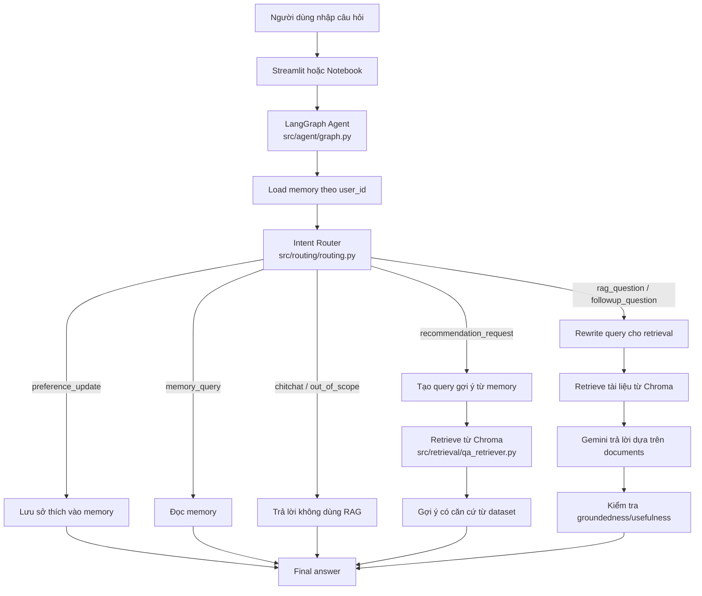

# Memory Agent - Trợ lý hỏi đáp văn hóa Việt Nam

Project này là baseline cho một trợ lý hỏi đáp về văn hóa Việt Nam, có RAG, intent router, memory theo từng người dùng, recommendation có căn cứ từ dataset và giao diện demo bằng Streamlit.

## Ý Tưởng Chính

Không phải câu nào của người dùng cũng nên đưa vào RAG.

Ví dụ:

- `Xe máy là gì?` -> câu hỏi RAG, cần retrieve tài liệu rồi Gemini trả lời.
- `Tôi thích lễ hội` -> cập nhật memory.
- `Tôi thích gì?` -> đọc memory.
- `Gợi ý cho tôi vài chủ đề phù hợp` -> dùng memory + retrieval để gợi ý.
- `Chào bạn` -> trả lời xã giao, không cần RAG.

Vì vậy project dùng **intent router** trước khi quyết định có chạy RAG hay không.

## Sơ Đồ Pipeline



## Cấu Trúc Project

```text
streamlit_app.py
  Giao diện web demo: chat, memory, multi-user.

memory_agent.ipynb
  Notebook thử nghiệm graph, test từng bước và showcase.

src/agent/config.py
  Load .env, cấu hình Chroma, Gemini, embedding model, memory file.

src/agent/graph.py
  Dựng LangGraph pipeline dùng cho Streamlit.

src/routing/routing.py
  Intent router, memory helper, recommendation helper, thread_id helper.

src/retrieval/qa_retriever.py
  Retriever cho Chroma, có lexical rerank.

src/ingestion/clean_qa_chunks.py
  Làm sạch dữ liệu và tạo QA chunks.

src/ingestion/build_chroma_index.py
  Build Chroma index từ chunks.

src/evaluation/baseline_eval.py
  Test nhanh intent router và retrieval.

docs/ARCHITECTURE.md
  Giải thích kiến trúc chi tiết.

docs/REPORT_NOTES.md
  Gợi ý nội dung viết báo cáo.

BASELINE_REPORT.md
  Tóm tắt trạng thái baseline hiện tại.
```

## Cài Đặt

Tạo file `.env` từ file mẫu:

```powershell
copy .env.example .env
```

Điền key:

```env
GOOGLE_API_KEY=your_gemini_api_key_here
HF_TOKEN=your_huggingface_token_if_needed
```

Cài thư viện:

```powershell
D:\anaconda\envs\rag\python.exe -m pip install -r requirements.txt
```

## Chạy Web Demo

```powershell
D:\anaconda\envs\rag\python.exe -m streamlit run streamlit_app.py --server.port 8501 --server.address 127.0.0.1
```

Mở:

```text
http://127.0.0.1:8501
```

Prompt demo:

```text
Tôi thích lễ hội và ẩm thực
Tôi thích gì?
Gợi ý cho tôi vài chủ đề phù hợp
Xe máy là gì?
```

Để demo multi-user, đổi `User ID` trong sidebar:

```text
demo_user_a
demo_user_b
```

Mỗi `user_id` có memory riêng.

## Chạy Notebook

Mở `memory_agent.ipynb`, restart kernel, chạy từ đầu đến cell:

```python
app = workflow.compile(checkpointer=memory_checkpointer)
```

Sau đó chạy các test:

```text
test_00_setup
test_01_preference_update
test_02_memory_query
test_03_recommendation
test_04_direct_retrieval
test_05_rag_smoke
test_06_cleanup
```

## Chạy Evaluation

```powershell
D:\anaconda\envs\rag\python.exe src\evaluation\baseline_eval.py --persist-dir D:\Ds107\chroma_db --collection langchain --device cpu --top-k 5 --fetch-k 40
```

Kết quả kỳ vọng:

```text
Intent:    5/5
Retrieval: 4/4
Total:     9/9
```

## Lưu Ý Khi Up GitHub

Các file/thư mục lớn hoặc nhạy cảm đã được `.gitignore` bỏ qua:

```text
.env
.cache/
chroma_db/
chroma_db_qa_hybrid/
chroma_db_qa_test/
vietnamese_vqa_dataset.json
user_memories.json
__pycache__/
```

Nếu deploy sang máy khác, cần copy `chroma_db/` hoặc build lại index.

## Hạn Chế Hiện Tại

- Memory đang dùng JSON, phù hợp demo nhưng chưa tốt cho nhiều user đồng thời.
- Chroma DB chưa được đưa lên Git do dung lượng lớn.
- Metadata trong index cũ còn lẫn tiếng Việt không dấu và tiếng Anh.
- Đây là baseline học thuật/demo, chưa phải production system.
