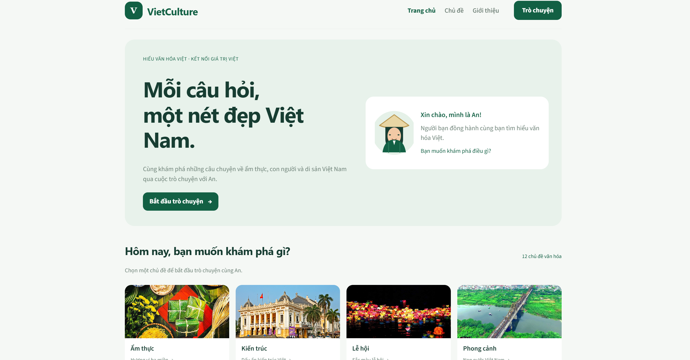
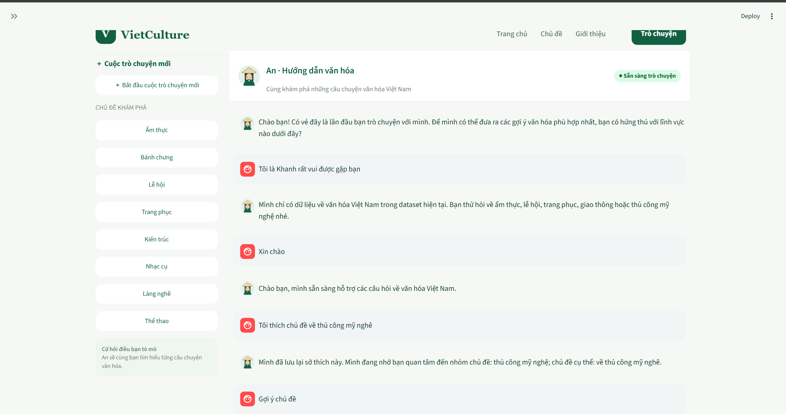
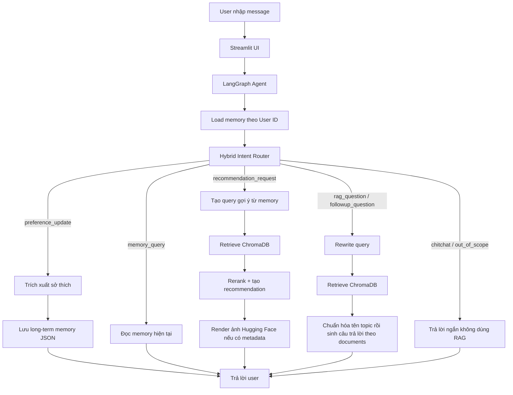

# VietCulture Assistant

VietCulture Assistant là chatbot hỏi đáp và gợi ý văn hóa Việt Nam theo hướng cá nhân hóa. Project kết hợp RAG trên ChromaDB, intent routing, long-term memory theo người dùng, recommendation dựa trên sở thích, và giao diện Streamlit có ảnh từ Hugging Face dataset.

Dataset tham chiếu: [Dangindev/viet-cultural-vqa](https://huggingface.co/datasets/Dangindev/viet-cultural-vqa)

## Giao Diện

### Màn hình chính



### Màn hình trò chuyện



## Tính Năng Chính

- Hỏi đáp văn hóa Việt Nam bằng RAG.
- Lưu sở thích người dùng theo `User ID`.
- Lưu danh sách hội thoại và transcript theo từng `User ID` bằng SQLite local; sidebar cho phép chuyển user và khôi phục hội thoại.
- Gợi ý chủ đề văn hóa dựa trên memory và tài liệu retrieve được.
- Hybrid intent router: rule-based router chạy trước, LLM chỉ fallback khi bật cấu hình.
- Chuẩn hóa cách hiển thị một số topic trước generation; giữ tên nguồn để truy vết.
- Khử chunk trùng nội dung trước generation và recommendation.
- Streamlit UI gồm màn chào, chat screen, avatar assistant, topic cards và recommendation cards có ảnh từ Hugging Face.
- Hỗ trợ build Chroma index riêng từ Vietnamese Cultural VQA dataset.

## Pipeline


```mermaid
flowchart TD
    A["User nhập message"] --> B["Streamlit UI"]
    B --> C["LangGraph Agent"]
    C --> D["Load memory theo User ID"]
    D --> E["Hybrid Intent Router"]

    E -->|"preference_update"| F["Trích xuất sở thích"]
    F --> G["Lưu long-term memory JSON"]
    G --> Z["Trả lời user"]

    E -->|"memory_query"| H["Đọc memory hiện tại"]
    H --> Z

    E -->|"recommendation_request"| I["Tạo query gợi ý từ memory"]
    I --> J["Retrieve ChromaDB"]
    J --> K["Rerank + tạo recommendation"]
    K --> L["Render ảnh Hugging Face nếu có metadata"]
    L --> Z

    E -->|"rag_question / followup_question"| M["Rewrite query"]
    M --> N["Retrieve ChromaDB"]
    N --> O["Chuẩn hóa tên topic rồi sinh câu trả lời theo documents"]
    O --> Z

    E -->|"chitchat / out_of_scope"| P["Trả lời ngắn không dùng RAG"]
    P --> Z
```

## Cấu Trúc Project

```text
streamlit_app.py
  Giao diện web Streamlit: welcome screen, chat, memory sidebar, ảnh Hugging Face.

assets/
  An avatar SVG dùng trong UI.

src/agent/
  config.py: đọc .env và cấu hình runtime.
  graph.py: LangGraph pipeline cho routing, memory, RAG và recommendation.

src/routing/
  intent_router.py: rule-based intent router.
  llm_intent_router.py: LLM fallback router.
  routing.py: compatibility layer cho API routing cũ.
  text_utils.py: helper chuẩn hóa text tiếng Việt.

src/memory/
  store.py: lưu/đọc memory JSON theo user_id.
  conversation_store.py: lưu danh sách hội thoại và transcript SQLite theo user_id.

src/recommendation/
  recommender.py: tạo recommendation query và câu trả lời gợi ý có căn cứ.

src/normalization/
  canonical_names.py: chuẩn hóa topic trước generation, giữ mapping tên nguồn.

src/retrieval/
  qa_retriever.py: load ChromaDB, query embedding, lexical rerank.

src/ingestion/
  clean_qa_chunks.py: chuyển raw VQA dataset thành QA chunks sạch.
  build_chroma_index.py: build Chroma index từ chunks.

src/evaluation/
  baseline_eval.py: test nhanh intent router và retrieval.

src/evaluation/fixtures/
  Bộ benchmark QA nhỏ để tái lập đánh giá.

tests/
  Unit test cho routing, memory, normalization và deduplication.

vector_index/
  Chroma index demo hiện tại, được theo dõi trên GitHub và đóng gói trong Docker image.

docs/screenshots/
  Ảnh màn hình chính và giao diện trò chuyện trong README.

Dockerfile, compose.yaml
  Build và chạy ứng dụng cùng Chroma index.

compose.registry.yaml
  Chạy Docker image đã được GitHub Actions publish lên GHCR.
```

## Cài Đặt

Tạo môi trường Python, sau đó cài dependencies:

```powershell
python -m pip install -r requirements.txt
```

Tạo file `.env` từ mẫu:

```powershell
copy .env.example .env
```

Mặc định project dùng DeepSeek qua ViLao (API tương thích OpenAI). Điền key của bạn vào `.env`:

```env
LLM_PROVIDER=vilao
LLM_BASE_URL=https://api.vilao.ai/v1
LLM_API_KEY=your_vilao_api_key_here
LLM_MODEL=chib/deepseek-v4.1-flash
HF_TOKEN=your_huggingface_token_if_needed

QA_RETRIEVER_PROFILE=legacy
QA_CHROMA_DIR=vector_index
QA_CHROMA_COLLECTION=vietculture_topic_qa_v1
QA_RETRIEVER_DEVICE=cpu
QA_TOP_K=5
QA_FETCH_K=50

USE_LLM_INTENT_ROUTER=false
LLM_INTENT_CONFIDENCE_THRESHOLD=0.75
```

Để bật LLM fallback cho intent chưa rõ, đổi `USE_LLM_INTENT_ROUTER=true`. Nếu muốn quay lại Gemini, đặt `LLM_PROVIDER=gemini`, `GOOGLE_API_KEY=...` và tùy chọn `GEMINI_MODEL=...`.

Cài dependency mới sau khi đổi provider:

```powershell
python -m pip install -r requirements.txt
```

## Chạy Streamlit Demo

```powershell
python -m streamlit run streamlit_app.py --server.port 8501 --server.address 127.0.0.1
```

Mở:

```text
http://127.0.0.1:8501
```

Transcript chat được lưu local trong `conversations.sqlite3` (đường dẫn có thể đổi bằng `CONVERSATION_DB` trong `.env`). SQLite phù hợp cho demo một máy và bị Git ignore. `User ID` chỉ phân tách dữ liệu trong giao diện, chưa phải đăng nhập/xác thực; khi chạy nhiều máy hoặc cần nhiều người dùng thật thì nên dùng database server và lớp xác thực.

Prompt demo:

```text
hello
tôi thích kiến trúc
tôi thích thể thao
tôi thích gì?
ý nghĩa văn hóa của bánh chưng là gì?
gợi ý chủ đề văn hóa
```

## ChromaDB Và Dataset

Project runtime cần ChromaDB local:

```text
QA_RETRIEVER_PROFILE=legacy
QA_CHROMA_DIR=vector_index
QA_CHROMA_COLLECTION=vietculture_topic_qa_v1
```

Index demo hiện tại trong `vector_index/` có 2,525 records và dung lượng khoảng 37 MB; được theo dõi để người clone repo build và chạy demo. Các index cũ/thử nghiệm và raw dataset vẫn không upload GitHub:

```text
chroma_db/
chroma_db_qa_hybrid/
chroma_db_qa_test/
data/vietnamese_vqa_dataset.json
data/
.cache/
rebuild_outputs/
```

Raw dataset đặt local tại `data/vietnamese_vqa_dataset.json` (thư mục `data/` bị ignore). Build lại index v2 bằng:

```powershell
python src\ingestion\build_topic_qa_index.py ^
  --dataset data\vietnamese_vqa_dataset.json ^
  --output-dir rebuild_outputs\topic_qa_v2 ^
  --max-qa-per-topic 5 ^
  --device cuda
```

Nếu máy không có GPU, có thể chạy bước build embedding trên Kaggle/Colab, tải thư mục Chroma về, rồi cấu hình `.env` trỏ tới thư mục đó.

Sau khi build và kiểm tra index mới trong `rebuild_outputs/`, chỉ thay `vector_index/` bằng index đã được chọn để cập nhật bản demo trên GitHub và Docker image.

## Chạy Bằng Docker

Cài Docker Desktop, clone repo, tạo `.env` từ mẫu và điền API key LLM của bạn. Không commit `.env` lên GitHub.

```powershell
Copy-Item .env.example .env
# Mở .env và điền LLM_API_KEY
docker compose up --build
```

Mở `http://localhost:8501`. Docker image đóng gói index từ `vector_index/`, nên người chạy không cần mount hay tải Chroma index riêng. Lần đầu, Sentence Transformers có thể tải embedding model từ Hugging Face; cần Internet. Model cache, SQLite transcript và user memory được lưu qua Docker volumes.

Compose mặc định dùng CPU để chạy embedding, phù hợp Docker Desktop phổ thông. Lần đầu có thể khởi động lâu hơn vì cài dependencies và tải model.

Sau khi GitHub Actions publish image lên GitHub Container Registry, có thể chạy image đã build bằng file `compose.registry.yaml`:

```powershell
Copy-Item .env.example .env
# Mở .env và điền LLM_API_KEY
docker compose -f compose.registry.yaml up
```

## Ảnh Hugging Face Trong UI

Streamlit không download ảnh về máy. UI dựng URL ảnh theo format:

```text
https://huggingface.co/datasets/Dangindev/viet-cultural-vqa/resolve/main/images/<category>/<folder>/<file>
```

Welcome screen dùng ảnh mẫu từ Hugging Face. Recommendation cards lấy `image_path` từ metadata trong Chroma; app không cần đọc raw dataset khi chạy.

## Chạy Evaluation

Evaluation baseline kiểm tra intent router và retrieval, không gọi API trả phí:

```powershell
python -m src.evaluation.baseline_eval --persist-dir vector_index --collection vietculture_topic_qa_v1 --device cpu
```

Bộ benchmark 240 câu nằm trong `src/evaluation/fixtures/`; output sinh ra trong `data/` và bị Git ignore.

## Quy Tắc Code Trong Project

Kiểm tra deterministic behavior mà không gọi LLM:

```powershell
python -m unittest discover -s tests -v
python -m src.evaluation.baseline_eval --persist-dir vector_index --collection vietculture_topic_qa_v1 --device cpu
```

Khi thêm hoặc sửa file Python, project ưu tiên:

- Comment và docstring bằng tiếng Việt.
- Đầu file nói rõ mục đích và flow chính.
- Trước mỗi hàm nên có mô tả biến đầu vào, ví dụ output và cách tự viết lại.
- Giữ module nhỏ, dễ đọc: routing, memory, recommendation, retrieval tách riêng.

Hướng dẫn nội bộ và notebook cá nhân không nằm trong repository phát hành.

## Checklist Trước Khi Upload GitHub

Không upload các file local hoặc dữ liệu lớn:

```text
.env
.streamlit/secrets.toml
.cache/
chroma_db/
chroma_db_qa_hybrid/
chroma_db_qa_test/
data/vietnamese_vqa_dataset.json
data/
reports/
notebooks/
.agents/
Design/
user_memories.json
conversations.sqlite3
__pycache__/
runtime/
```

Ngoại lệ dữ liệu được theo dõi: `vector_index/` là Chroma index demo đang dùng (2,525 records, khoảng 37 MB). GitHub Actions dùng index này để build và publish image `ghcr.io/khanhdao1512/vietculture-rag`.

Kiểm tra trước khi commit:

```powershell
git status --short
python -m py_compile streamlit_app.py
python -m compileall src
```

Không commit `.env`, runtime memory, SQLite transcript, cache model, raw dataset, notebook hoặc report. `vector_index/` là index demo duy nhất được theo dõi để Docker build tái lập được.

Sau lần publish đầu, GitHub Container Registry có thể để package ở chế độ private. Nếu muốn người dùng tải image công khai, đổi package visibility thành Public trong phần package settings của GitHub.

## Hạn Chế Hiện Tại

- Memory đang lưu bằng JSON, phù hợp demo nhưng chưa tối ưu cho nhiều user đồng thời.
- Khi mở lại thread sau khi app restart, transcript SQLite được nạp làm ngữ cảnh cho LangGraph.
- Index legacy có thể thiếu `image_path`; khi đó UI dựng URL bằng fallback theo category/topic.
- Một số keyword trong dataset/index còn lẫn không dấu, có thể làm recommendation text chưa thật đẹp.
- Chưa phải production system: chưa có auth, database server, rate limit hoặc logging đầy đủ.

