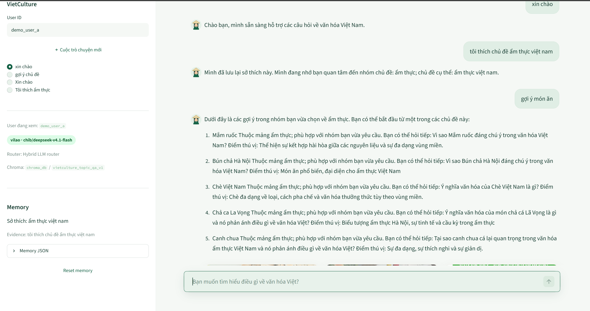
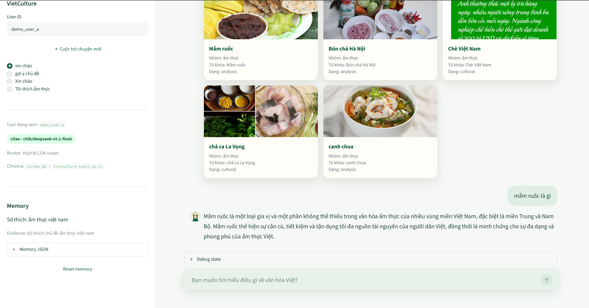

# VietCulture Assistant

Chatbot hỏi đáp và gợi ý về văn hóa Việt Nam. Ứng dụng dùng RAG với ChromaDB, LangGraph để điều phối hội thoại, Streamlit cho giao diện và lưu memory theo `User ID`.

## Giao diện

### Màn hình chính — 12 chủ đề văn hóa


### Trò chuyện và gợi ý chủ đề



### Trò chuyện hỏi đáp



## Chạy bằng Docker

Cần Docker Desktop và API key tương thích OpenAI, ví dụ ViLao. Tạo `.env` từ mẫu rồi điền `LLM_API_KEY`:

```powershell
Copy-Item .env.example .env
```

Để chạy image mới nhất đã publish trên GHCR:

```powershell
docker compose -f compose.registry.yaml pull
docker compose -f compose.registry.yaml up -d
```

Mở <http://localhost:8501>. Image đã chứa Chroma index demo; hội thoại và memory được lưu local qua Docker volumes. Lần chạy đầu có thể tải embedding model từ Hugging Face.

Để build image trực tiếp từ source:

```powershell
docker compose up --build -d
```

## Chạy local để phát triển

```powershell
python -m pip install -r requirements.txt
Copy-Item .env.example .env
python -m streamlit run streamlit_app.py --server.port 8501
```

Trong `.env`, cấu hình `LLM_API_KEY`. Mặc định project dùng ViLao/DeepSeek; có thể xem các tùy chọn khác trong `.env.example`.

## Tính năng

- Hỏi đáp có căn cứ trên VietCulturalVQA qua ChromaDB.
- Gợi ý 3–5 chủ đề dựa trên sở thích và tài liệu truy xuất được.
- Hybrid intent routing, chuẩn hóa tên chủ đề và khử trùng lặp.
- Memory người dùng và lịch sử hội thoại SQLite trên máy chạy ứng dụng.
- Hỗ trợ 12 nhóm văn hóa. Dataset tham chiếu: [VietCulturalVQA](https://huggingface.co/datasets/Dangindev/viet-cultural-vqa).

## Kiểm thử

```powershell
python -m unittest discover -s tests -v
```

## Cấu trúc chính

```text
streamlit_app.py       Giao diện Streamlit
src/agent/             Cấu hình và LangGraph pipeline
src/routing/           Phân loại intent
src/retrieval/         Truy xuất và rerank ChromaDB
src/recommendation/    Tạo gợi ý có căn cứ
src/normalization/     Chuẩn hóa tên hiển thị
src/memory/            Memory người dùng và hội thoại SQLite
vector_index/          Chroma index demo
tests/                 Unit tests
docs/screenshots/      Ảnh trong README
```
