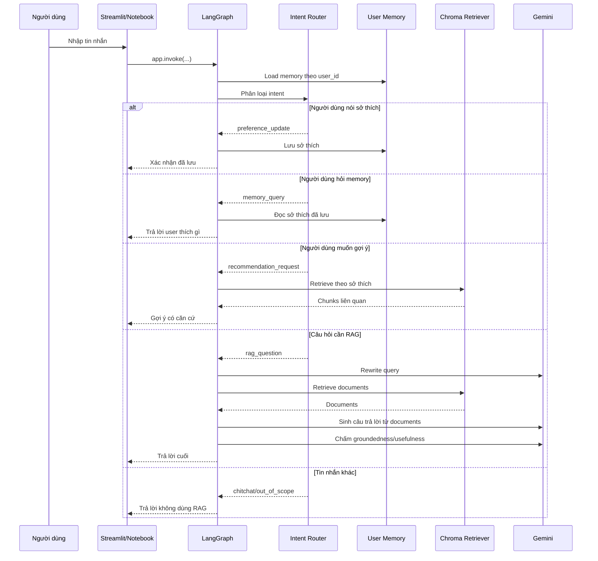

# Kiến Trúc Project

File này giải thích chi tiết hơn cách hệ thống hoạt động để hỗ trợ viết báo cáo.

## 1. Tổng Quan

Project gồm 4 phần chính:

1. **Giao diện**: `streamlit_app.py` hoặc `memory_agent.ipynb`.
2. **LangGraph Agent**: điều phối các node xử lý.
3. **Retriever**: tìm tài liệu liên quan từ Chroma.
4. **Memory**: lưu sở thích dài hạn theo `user_id`.

## 2. Luồng Xử Lý Một Câu Hỏi



## 3. Các Module Chính

### `src/agent/config.py`

Vai trò:

- Load `.env`.
- Đọc `GOOGLE_API_KEY`.
- Chọn Chroma index.
- Cấu hình embedding model, device, top-k, memory file.

### `src/agent/graph.py`

Vai trò:

- Dựng LangGraph pipeline.
- Tạo các node: `load_memory`, `route_intent`, `non_rag_intent`, `transform`, `rag`, `generate`, `update_memory`.
- Tạo Gemini chain cho RAG generation.
- Tạo grader để kiểm tra groundedness/usefulness.

Điểm quan trọng:

```text
RAG question không tự động trở thành sở thích của user.
```

Ví dụ `Xe máy là gì?` không được lưu thành `user thích giao thông`.

### `src/routing/routing.py`

Vai trò:

- Normalize tiếng Việt để match intent.
- Phân loại intent.
- Trích xuất sở thích từ câu như `Tôi thích lễ hội`.
- Load/save memory JSON.
- Build recommendation từ memory.
- Tạo `thread_id` chuẩn cho LangGraph.

Chuẩn multi-user:

```python
thread_id = f"user:{user_id}:thread:{conversation_id}"
```

### `src/retrieval/qa_retriever.py`

Vai trò:

- Load Chroma.
- Embed query.
- Retrieve nhiều candidates.
- Rerank bằng lexical/topic matching.
- Format kết quả để debug.

### `src/ingestion/clean_qa_chunks.py`

Vai trò:

- Làm sạch dataset.
- Tạo QA chunks.
- Chuẩn hóa topic/category/question type.
- Deduplicate.

### `src/ingestion/build_chroma_index.py`

Vai trò:

- Đọc chunks.
- Tạo embeddings.
- Lưu Chroma index.

### `src/evaluation/baseline_eval.py`

Vai trò:

- Test intent router.
- Test retrieval.
- In pass/fail summary.

## 4. Thiết Kế Memory

Memory hiện lưu trong JSON:

```json
{
  "demo_user_a": {
    "categories": ["le_hoi"],
    "topics": ["lễ hội"],
    "keywords": ["lễ hội"],
    "normalized_keywords": ["le hoi"],
    "evidence": ["Tôi thích lễ hội"],
    "last_updated": "..."
  }
}
```

Chính sách hiện tại:

- Chỉ lưu khi intent là `preference_update`.
- Không lưu khi user chỉ hỏi kiến thức.
- Recommendation dùng memory để retrieve nội dung phù hợp.

## 5. Vì Sao Cần Intent Router?

Nếu không có router, mọi tin nhắn đều đi qua RAG. Điều đó không hợp lý:

- `Tôi thích lễ hội` không phải câu hỏi RAG.
- `Tôi thích gì?` nên đọc memory.
- `Gợi ý cho tôi...` cần recommendation.
- `Xe máy là gì?` mới cần RAG.

Router giúp hệ thống rõ ràng hơn, ít tốn API hơn và dễ debug hơn.

## 6. Deploy

Hiện tại deploy đơn giản bằng Streamlit:

```powershell
D:\anaconda\envs\rag\python.exe -m streamlit run streamlit_app.py
```

Khi deploy sang môi trường khác cần chuẩn bị:

- `GOOGLE_API_KEY`.
- Chroma index.
- Dependencies trong `requirements.txt`.

Vì Chroma DB và dataset lớn, repo GitHub không commit trực tiếp các file này.
